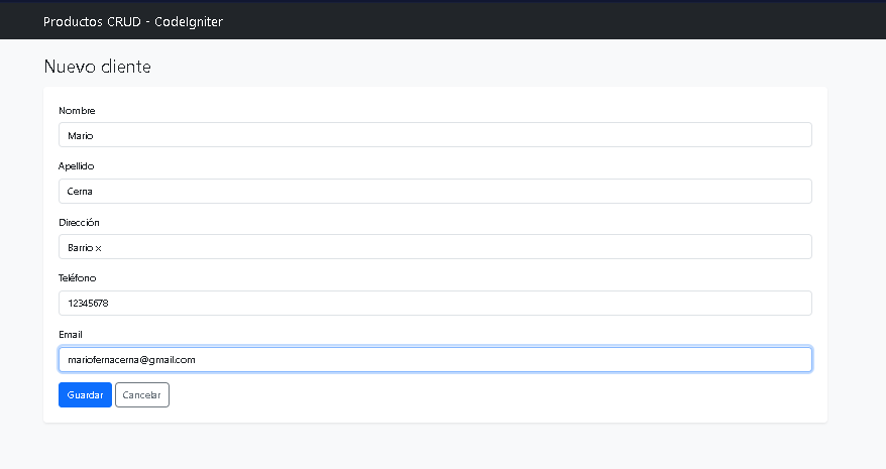
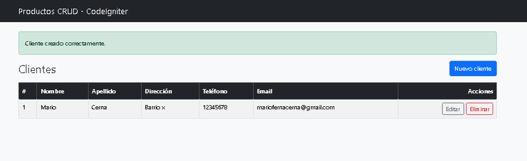
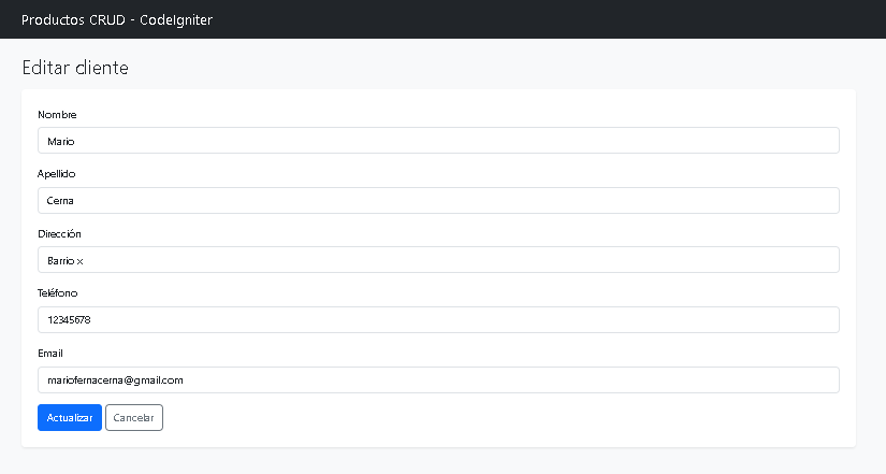
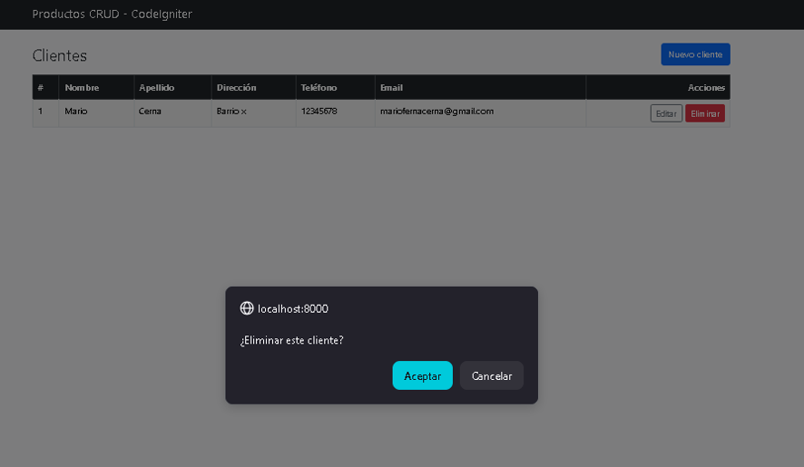
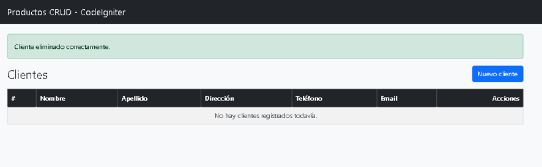

# 📋 Informe de Actividad — Familiarización con CodeIgniter 3

Actividad previa al proyecto del módulo "Oficina del Agua".
Stack asignado: **CodeIgniter**. 
---

## 1. Nombre del proyecto

**Productos CRUD — CodeIgniter 3**: aplicación de prueba de concepto que
implementa un CRUD completo (crear, listar, editar, eliminar) de productos,
sobre el cual construí mi propio CRUD de **clientes** (entidad del dominio
"Oficina del Agua") aplicando el mismo patrón.

## 2. Stack utilizado

| Tecnología | Uso |
|---|---|
| PHP 8.3 | Lenguaje del backend (imagen `php:8.3-apache`) |
| CodeIgniter 3.x | Framework MVC |
| MariaDB 11.4 | Motor de base de datos |
| Bootstrap 5 (CDN) | Estilos e interfaz |
| Composer | Gestor de dependencias PHP |
| vlucas/phpdotenv | Carga de variables de entorno (`.env`) |
| Docker + Docker Compose | Entorno de ejecución reproducible |

## 3. Requisitos

Para ejecutar este proyecto solo se necesita **Docker Desktop**, ya que PHP,
Apache y la base de datos corren en contenedores. Sin Docker, la alternativa
es PHP 8.1+, Composer y un MySQL/MariaDB local.

## 4. Instalación

Las dependencias PHP se administran con **Composer**
(`composer.json` / `composer.lock`). Si la carpeta `vendor/` no está presente:

```bash
composer install
```

En este proyecto `vendor/` viene incluido y además se monta dentro del
contenedor, por lo que con Docker no hace falta instalar nada a mano.

## 5. Configuración

- **Variables de entorno**: copiar `.env.example` a `.env`
  (`DB_HOSTNAME`, `DB_USERNAME`, `DB_PASSWORD`, `DB_DATABASE`).
  La carga ocurre en `index.php` mediante phpdotenv antes de arrancar el framework.
  En Docker, las variables definidas en `docker-compose.yml` tienen prioridad
  sobre `.env` (phpdotenv se carga en modo inmutable).
- **Configuración general** (`application/config/config.php`):
  `base_url` fijada a `http://localhost:8000/`,
  `sess_save_path = sys_get_temp_dir()` y `csrf_protection = TRUE`.
- **Base de datos** (`application/config/database.php`):
  lee las variables con `getenv()` y tiene valores por defecto si no existe `.env`.

## 6. Base de datos

- **Motor**: MariaDB 11.4 (compatible MySQL).
- **Conexión**: configurada en `application/config/database.php`; el grupo
  `default` crea el objeto `$this->db`.
- **Estructura de tablas**: se define con scripts SQL manuales en `database/`
  (`schema.sql` para productos, `schema_cliente.sql` para clientes).
  ⚠️ CodeIgniter 3 **no usa migraciones** como Laravel; el equivalente aquí
  son los scripts SQL. Con Docker, el script se ejecuta automáticamente la
  primera vez que se crea el volumen (montado en `/docker-entrypoint-initdb.d/`).

Operaciones CRUD (implementadas con **Query Builder** en el modelo,
que escapa los valores automáticamente):

| Operación | Método del modelo | SQL equivalente |
|---|---|---|
| Insertar | `$this->db->insert('clientes', $datos)` | INSERT INTO ... |
| Consultar todos | `->get('clientes')->result()` | SELECT * ... (varias filas) |
| Consultar uno | `->where('id',$id)->get(...)->row()` | SELECT ... WHERE id=... (una fila) |
| Actualizar | `->where('id',$id)->update(...)` | UPDATE ... WHERE id=... |
| Eliminar | `->where('id',$id)->delete(...)` | DELETE ... WHERE id=... |

## 7. Ejecución

```bash
docker compose up -d --build     # primera vez (construye imágenes)
```

Aplicación disponible en:

- Productos: <http://localhost:8000/index.php/productos>
- Clientes (mi práctica): <http://localhost:8000/index.php/clientes>

Comandos útiles: `docker compose stop|start|down` (los datos persisten en el
volumen `db_data`); `docker compose down -v` reinicializa la base de datos.

## 8. Estructura del proyecto

| Pregunta | Respuesta |
|---|---|
| ¿Dónde están las rutas? | `application/config/routes.php` define el controlador por defecto; además CI3 resuelve por convención: `index.php/controlador/metodo/parametro` |
| ¿Dónde están los controladores? | `application/controllers/` (`Productos.php`, `Clientes.php`) |
| ¿Dónde están los modelos? | `application/models/` (`Producto_model.php`, `Cliente_model.php`) |
| ¿Dónde están las vistas? | `application/views/` (por entidad + plantillas compartidas en `templates/`) |
| ¿Dónde está la configuración? | `application/config/` (`config.php`, `database.php`, `routes.php`, `autoload.php`, etc.) |
| ¿Dónde están las migraciones? | No existen en CI3; su equivalente son los scripts SQL de `database/` |
| ¿Dónde se administran las dependencias? | Composer: `composer.json`, `composer.lock`, carpeta `vendor/` |

Piezas clave del directorio `application/config/`:

- `autoload.php`: componentes que se cargan solos en cada petición
  (aquí: librerías `database` y `session`, helpers `url` y `form`).
- `constants.php`: constantes fijas (permisos de archivos, códigos de salida).
- `hooks.php` / `memcached.php` / `foreign_chars.php`: disponibles pero sin uso en este proyecto.

## 9. Flujo de una petición (ejemplo: crear cliente)

```
Navegador envía POST /index.php/clientes/crear (con token CSRF)
   ↓ index.php carga .env, autoload y arranca el framework
Router identifica controlador Clientes, método crear()
   ↓ form_validation valida las reglas del servidor
Cliente_model->crear($datos)  →  $this->db->insert()  →  MariaDB
   ↓ flashdata guarda el mensaje de éxito para la siguiente petición
redirect() a la lista  →  vista clientes/index muestra la tabla + mensaje
```

Cada petición repite el ciclo completo: PHP destruye todo al final, y solo
la base de datos y la sesión conservan información entre peticiones.

## 10. Problemas encontrados y soluciones

| # | Problema | Causa | Solución |
|---|---|---|---|
| 1 | `Access denied for user 'root'@'localhost'` al conectar | El volumen de MariaDB se había inicializado antes con otra contraseña; solo se configura en el primer arranque | `docker compose down -v` y volver a levantar para reinicializar con la contraseña correcta y ejecutar el schema |
| 2 | Warnings `mkdir(): Invalid path` y `session_start(): Failed to initialize storage module` | `sess_save_path` era NULL y el contenedor PHP no trae `session.save_path` definido | Fijar `$config['sess_save_path'] = sys_get_temp_dir()` (funciona en Docker y localmente) |
| 3 | Los botones llevaban a `http://172.18.0.3/...` y la página caía | `base_url` vacía hace que CI3 autodetecte la IP interna del contenedor | Fijar `$config['base_url'] = 'http://localhost:8000/'` |
| 4 | Error 404 de Apache al hacer clic en botones | Las vistas usaban `base_url()`, que NO incluye `index.php`; sin mod_rewrite esas rutas no existen | Cambiar a `site_url()` en los enlaces de navegación (incluye el `index_page` automáticamente) |
| 5 | `ERROR 1064` al importar el script SQL | Usé `//` como comentario, que no es válido en SQL | Los comentarios en SQL van con `--` (y espacio después de los guiones) |
| 6 | `failed to connect to the docker API` | Docker Desktop estaba apagado | Iniciar Docker Desktop y esperar a que el motor esté corriendo |

## 11. Buenas prácticas investigadas

1. **Separación de responsabilidades (MVC)**: controlador (flujo), modelo
   (datos), vista (presentación). Facilita mantener y probar cada parte por separado.
2. **Query Builder en lugar de SQL concatenado**: escapa valores
   automáticamente y reduce drásticamente el riesgo de inyección SQL.
3. **Validación siempre en el servidor** (`form_validation`): el `required`
   de HTML es cómodo pero se puede burlar; la regla del servidor es la real.
4. **Protección CSRF activa**: `form_open()` inserta un token único por
   formulario; evita que sitios externos envíen acciones en nombre del usuario.
5. **Escape de salida con `html_escape()`** en las vistas: neutraliza XSS
   cuando un usuario guarda `<script>` como texto.
6. **Credenciales fuera del código** (variables de entorno + `.gitignore`),
   nunca versionar el `.env` real.

## 12. Reflexión técnica

**1. ¿Qué fue lo más costoso de entender del framework?**
Entender que todo pasa por `index.php` y cómo se construyen las URLs:
la diferencia entre `base_url()` y `site_url()` (esta última agrega
`index.php` automáticamente) me causó dos errores distintos hasta que lo
entendí. También me costó asimilar que cada petición reconstruye toda la
aplicación desde cero y que nada sobrevive salvo BD y sesión.

**2. ¿Qué parte de la estructura te pareció más importante?**
La carpeta `application/config/`. Ahí viven las decisiones de toda la app
(conexión a BD, sesiones, CSRF, rutas, autoload). Cuando algo falla,
casi siempre la respuesta empieza revisando ahí.

**3. ¿Cómo funciona una petición, con tus propias palabras?**
El navegador pide una URL que siempre entra por `index.php`. Ese archivo
prepara el entorno (variables de entorno, autoload) y arranca el framework;
el router deduce qué controlador y método atender según la URL; el método
usa el modelo para hablar con la base de datos y finalmente carga vistas
que devuelven HTML al navegador. Después de responder, PHP borra todo de
memoria hasta la siguiente petición.

**4. Tres buenas prácticas y por qué importan**
- *Query Builder*: previene inyección SQL sin esfuerzo manual.
- *Validación de servidor*: es la única que no puede ser burlada desde el navegador.
- *CSRF + escape de salida*: cubren los ataques web más comunes (envíos
  falsificados e inyección de scripts). Las tres comparten la idea de
  "no confiar en nada que venga del usuario".

**5. Un problema técnico y cómo lo resolví**
El error `Access denied` de MariaDB: descubrí con `printenv` que las
credenciales llegaban bien al contenedor web, y probando conexión manual
con `mariadb -u root -p` confirmé que el problema era la contraseña
almacenada. Investigué que la inicialización de MariaDB en Docker ocurre
solo la primera vez que se crea el volumen, así que `docker compose down -v`
reinicializó todo correctamente. Me enseñó a diagnosticar por capas
(variables → red → servicio) en vez de adivinar.

**6. ¿Qué te llevas para el proyecto del módulo?**
Un entorno Docker reproducible que puedo armar y tirar sin miedo
(`down -v` incluido), el mapa mental de dónde vive cada cosa en CI3
(`config/`, controllers, models, views) y la disciplina de validar y
escapar todo lo que entra y sale. También aprendí a leer los errores con
calma: casi siempre dicen exactamente qué capa falló.














